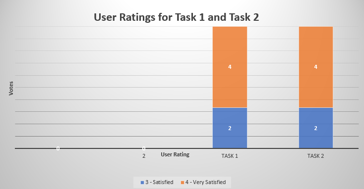

# Phase III: Prototypes and User Testing

## Introduction

With developing an Interactive Prototype (Using Wireframes made during Phase II) during this phase, a Usability Test was conducted to determine how Effective, Efficicent, and Satisfactory the application was at completing two tasks: Adjusting multiple device settings and creating a playlist. The results are then used to improve the application's design, functionality, and to create a better user experience.  

## Methods

The research method for Phase III was a Usability Test (n = 6) done on the BlueConnect Prototype. The [Protocol](../phaseIII/Protocol.pdf) was used by the moderator to conduct the test and data was collected into a [Spreadsheet](https://docs.google.com/spreadsheets/d/1luWYVmIG-7Ci7HbFj4Ql9mjTNEpF34J8a3IvDMtyEwY/edit?usp=sharing). But before the test could begin, the partipant is handed a [Informed Consent Form](../phaseIII/Informed_Consent_Form.pdf) that they must sign for the test to continue.  
 

### Below the Protocol will be broken down to assess the methodology of the Usability Test (In order of Methods):  

### Method 1:	Introduce application to participants then survey participants to gather demographic and background information.

##### Introduction:
Welcome! Thank you for participating in our study. Your feedback is essential in helping us improve the functionality and design of the BlueConnect app. In this session, you will be asked to connect multiple Bluetooth devices using our application. Please feel free to speak aloud your thoughts and experiences as you navigate through the tasks.

##### Background:
Before we begin, we would like to know a little about your previous experiences with Bluetooth devices and your expectations from an application like BlueConnect.  

The Intro serves as a way to ease the participant into the study and establish a tone for how the test will be conducted. The Background is to assess the participants' experiences with Bluetooth to see how knowledgeable they are to the overall functionality.

### Method 2:	Have participants complete Task 1 and record any observations from participant, success of task, and user rating.

##### Task 1: Multi-Device Configuration
Participants will be instructed to connect a smartphone and a wireless earbud set simultaneously. They will then be asked to customize the audio settings for each device through the BlueConnect app. Participants will further engage in optimizing their audio experience by adjusting the equalizer settings on the BlueConnect app, allowing them to fine-tune the audio mix to their preferences, emphasizing bass or treble frequencies for both smartphone notifications and wireless earbuds, ensuring a personalized and immersive auditory environment.

Configuration is the most important part for each Bluetooth device. Feedback/User Ratings here will be used to improve learnability, natural mapping, and overall conventions. The buttons should be easy to understand, easy to see (visible), and match how the user expects the application to function.

### Method 3:	Have participants complete Task 2 and record any observations from participant, success of task, and user rating.

##### Task 2: Create a playlist
Participants will be asked to create a playlist. Navigating to the playlist screen, naming the playlist, then adding a song to the playlist.

Since this application is a music player, users should be able to create custom playlists. Feedback/User Ratings here will provide help in designing layout and/or how much freedom is given to users (E.g., freedom to custom make visual for playlist).

### Method 4: Record user rating and feedback on their overall experience.

This gets the participants overall impression of the application by getting what they found was the most important need for improvement (or bright spot of application) and this will be used to further improve notable flaws in the application. This will provide the total effectiveness, efficiency, and user satisfaction.

## Findings

The findings from the Usability Test were collated into this [Spreadsheet](https://docs.google.com/spreadsheets/d/1luWYVmIG-7Ci7HbFj4Ql9mjTNEpF34J8a3IvDMtyEwY/edit?usp=sharing).

### Qualitative Data:

There were several areas of improvement suggested by the participants: 
- There is a lack of continuity as the settings would refresh
- There should be a notification to inform a user that preset, playlists, etc. have saved
- Clearer design for the mixer (E.g., a slider that slides instead of being a notch)
- Make the design of each screen less cluttered

From the suggestions, the main issues can be derived to functionality and flow of the application. There is a mismatch between the participants mental model with the conceptual model for BlueConnect. Some buttons behave differently from what a user is expecting and there should be more feedback coming from the interaction (E.x. Notifications for whether something saved). There is also a need to simplify the design even further to make the screen look less busy (cluttered) and easier to comprehend so all the functions can be seen. 

### Quantitative Data:

From the spreadsheet, 100% of the participants were able to complete Task 1 and Task 2. Also, the User Ratings from Task 1 & Task 2 (and to that extent the overall test) both had 33% of participants give a score of 3 (satisfied) and 67% of participants give a score of 4 (very satisfied). From looking at the qualitative data mentioned previously, and the quantitative data attained from user satisfaction/success, the application is satisfying to use but lacks effectiveness to communicate how the applicaiton functions.

## Conclusions

While 100% of participants were able to successfully complete both tasks, we did receive lots of useful feedback on ways that the applications design could be improved in order to streamline its use.  User insights indicated that future designs should have more visual clarity, such as decluttering the screen and more clearly indicating what can and cannot be interacted with.  Additionally, better feedback when an action is performed would help alleviate user confusion on whether an action was successful.

Show percentage of some thing and explain why

## Caveats

Our sample size was somewhat small and having all the participants come from the same demographic (college students) may have skewed our results a bit.  We did not have any participants who had no experience with Bluetooth devices meaning that we got no data on how people with no previous knowledge of Bluetooth apps would interact with our design. Additionally testing with a prototype can lead to the oversight of issues with features that are not fully implemented in the prototype but will be in the applications final release.
