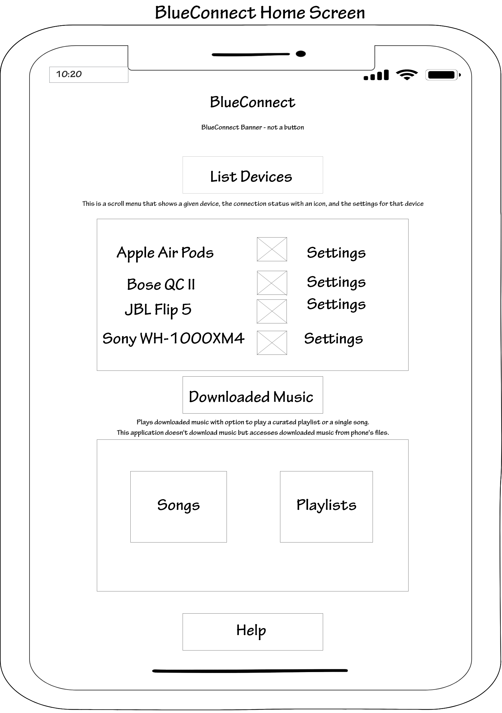
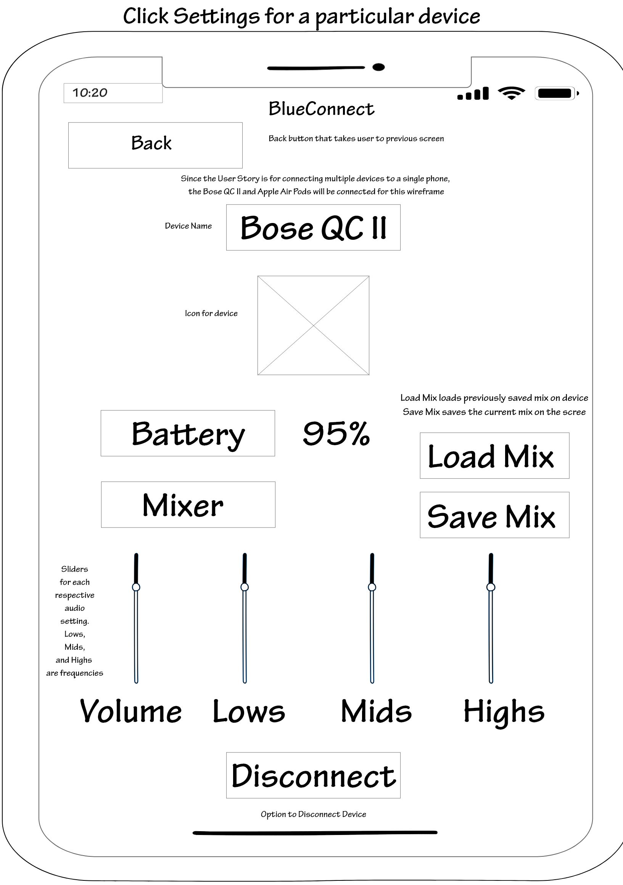
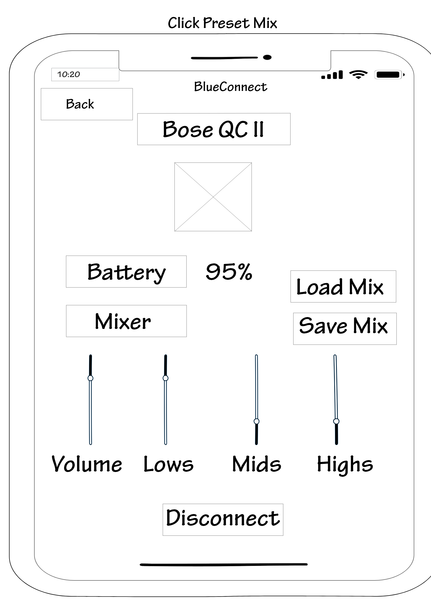
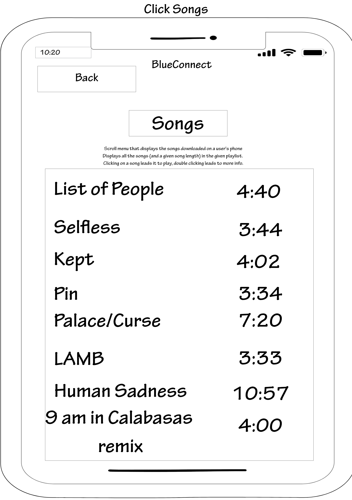
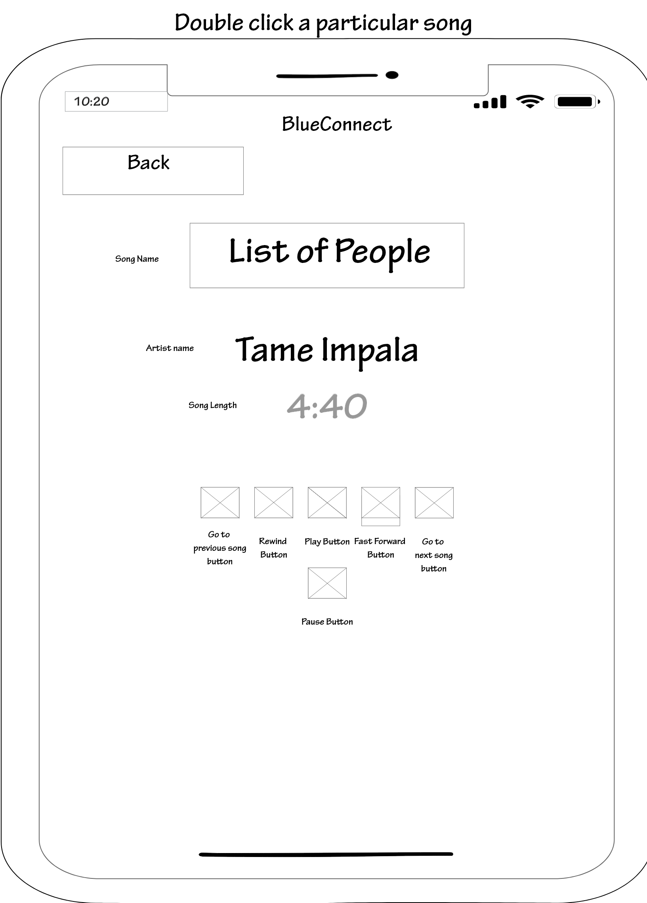
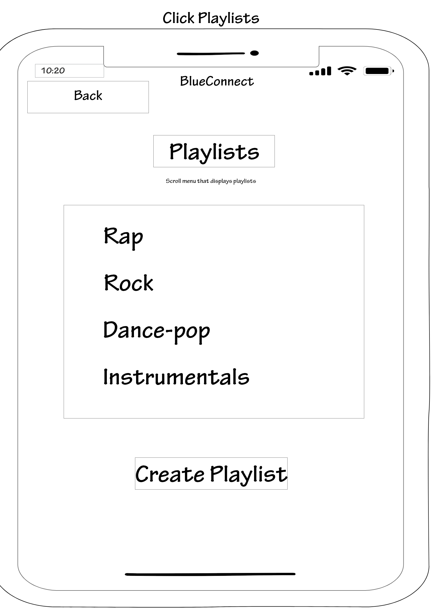
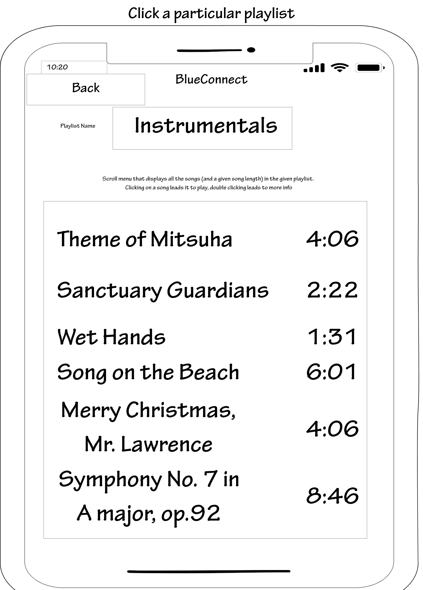
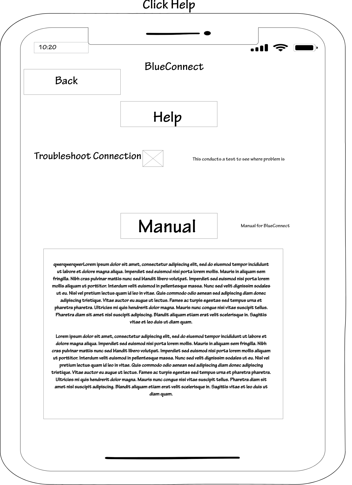
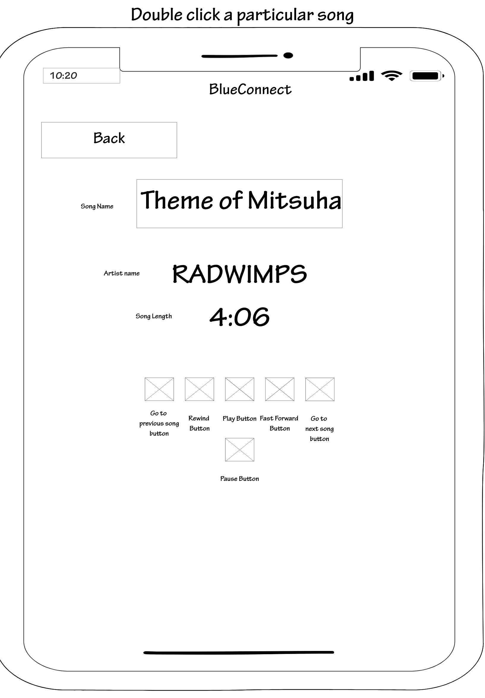
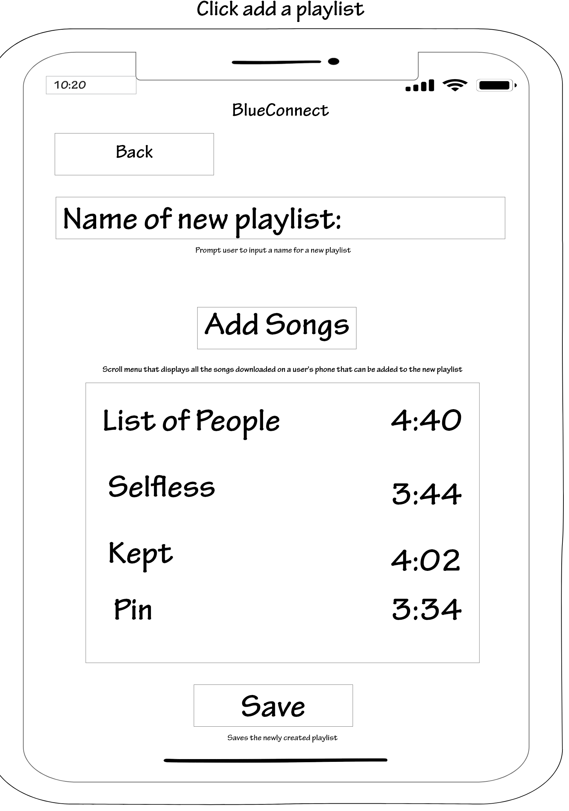

# Wireframes

In this folder there are two wireframes: one done with the cognitive walkthrough (the before) and one revised using the cognitive walkthrough and informal feedback (the finalized). The finalized wireframe has each screen as an artboard and will be briefly described below.

## Finalized Wireframe
There is a back button implemented on everypage but the homescreen that takes the user to the previously visited screen.

### Home Screen:
This screen displays the main functions of BlueConnect: the ability to connect multiple devices, adjust the settings of a device, play downloaded music individually or as a playlist, and request help if needed.

### Device Settings:
This screen displays the settings of a selected device when the "Settings" button is pressed in the home screen. Here a user can see the battery percentage of a device, create a mix, disconnect a device. The mix has four sliders: volume, lows, mids, and highs. Volume is for how load a user wants a speaker, earphone, etc. to output audio while lows, mids, and highs control the respective frequencies. The "Save Mix" button saves the current mix on the screen while the "Load Mix" loads the previously saved mix.

### Load Mix of a Device:
After pressing the "Load Mix" button, this screen is displayed. This screen just loads the previously saved mix of the current device.

### Songs:
This screen displays all the downloaded songs in a scroll menu when the "Songs" button is pressed in the home screen. The song length is also given right next to a song name. To play a song a user just clicks a song while double-clicking a song leads to the song's details. 

### Song Details:
This screen displays whenever a user double-clicks on a song - this can occur when a user is in the "Songs" screen or on a particular "Playlist" screen. The user has the option of going to the song before, rewind the current song, pause/play current song, fast forward the current song, or go to the next song.

### Playlists:
This screen displays saved playlists in a scroll menu and there is a "Create Playlist" button that allows a user to create a custom playlist.
Selecting a playlist causes the screen to change to the "Playlist Details" screen.

### Playlist Details:
Clicking a playlist in the "Playlists" screen leads to the details of that playlist. The pl

